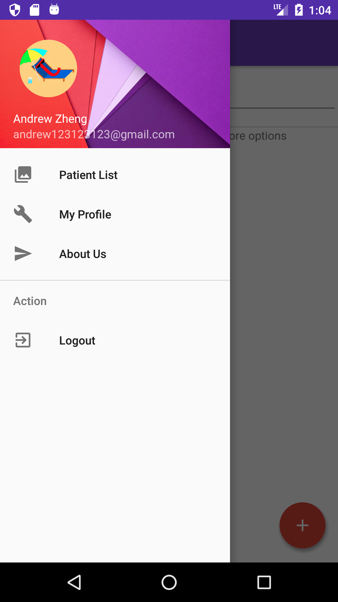
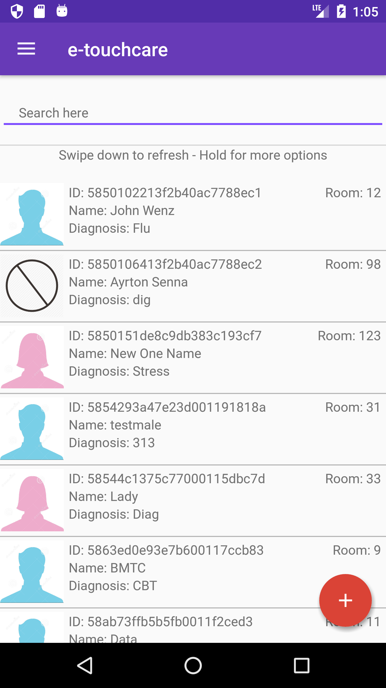

# EtouchCare - Android
The main purpose of the app is to improve the experience and accessibility for the Hospital staff and the patients. Develop a Mobile App that allows the doctors and other staff to be connected with the Hospital database in real-time directly from a portable device increase the service effectiveness. From the patient perspective, been able to access tests results, or get reminders before appointments improves patient’s satisfaction and hospital reliability.

Guilherme Morais -300878610 Wenzhong Zheng -300909195 Jose Apablaza -300823547

## Screen Shots

